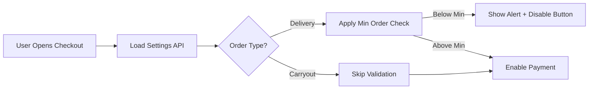

# Checkout Settings - Quick Reference Card

## 🎯 What Changed

**Before**: Hardcoded delivery fee (₦200), no minimum order validation  
**After**: Dynamic settings from admin panel, full validation

---

## 📍 Current Settings

| Setting | Value | Where Used |
|---------|-------|------------|
| Min Order | **₦2,000** | Delivery only |
| Delivery Fee | **₦750** | Delivery orders |
| Tax Rate | 7.5% | All orders |

---

## 🔑 Key Files

```
app/api/delivery/settings/route.ts   ← New API endpoint
hooks/use-settings.ts                ← Added useDeliverySettings()
components/checkout/checkout-form.tsx ← Validation logic
components/checkout/order-summary.tsx ← Dynamic fees
components/ui/alert.tsx              ← New component
```

---

## 🧪 Quick Test

```bash
# 1. Start dev server
npm run dev

# 2. Test minimum order validation
- Add ₦1,000 item → Checkout → See alert ❌
- Add ₦2,500 item → Checkout → No alert ✅

# 3. Test delivery fee
- Delivery order → Fee = ₦750 ✅
- Carryout order → Fee = ₦0 ✅
```

---

## 💻 Code Snippets

### Using Delivery Settings Hook
```typescript
import { useDeliverySettings } from '@/hooks/use-settings';

const { data: deliverySettings } = useDeliverySettings();
// deliverySettings.min_order
// deliverySettings.delivery_fee
```

### Validation Logic
```typescript
const isBelowMinimum = 
  orderType === 'delivery' && 
  subtotal < (deliverySettings?.min_order || 0);
```

---

## 🎨 UI Components

### Alert (Minimum Order Warning)
```tsx
{isBelowMinimum && (
  <Alert variant="destructive">
    <AlertCircle className="h-4 w-4" />
    <AlertDescription>
      Minimum order amount for delivery is {formatCurrency(minOrder)}.
      Your current subtotal is {formatCurrency(subtotal)}.
      Please add {formatCurrency(minOrder - subtotal)} more.
    </AlertDescription>
  </Alert>
)}
```

---

## 🔄 How It Works



---

## 🐛 Troubleshooting

| Issue | Solution |
|-------|----------|
| Old delivery fee showing | Clear cache, hard refresh (Ctrl+Shift+R) |
| Alert not appearing | Check browser console for errors |
| Settings not updating | Wait 10 mins or restart server |

---

## 📊 API Response

```json
GET /api/delivery/settings

{
  "enabled": true,
  "cities": ["Awka", "Nsukka"],
  "min_order": 2000,
  "delivery_fee": 750
}
```

---

## ✅ Validation Rules

| Order Type | Min Order | Delivery Fee | Validation |
|------------|-----------|--------------|------------|
| Delivery | ₦2,000 | ₦750 | ✅ Enforced |
| Carryout | None | ₦0 | ❌ Skipped |

---

## 🎯 Success Indicators

✅ Delivery fee is ₦750 (not ₦200)  
✅ Alert shows when subtotal < ₦2,000  
✅ Button disabled when below minimum  
✅ Carryout orders have no minimum  
✅ Order summary shows correct fees  

---

## 📝 Admin Changes

To modify settings:
1. Admin Panel → Settings → Delivery
2. Update values
3. Save Changes
4. **Effect**: Immediate (cache: 10 min)

---

**Status**: ✅ Production Ready  
**TypeScript**: ✅ No Errors  
**Documentation**: ✅ Complete
